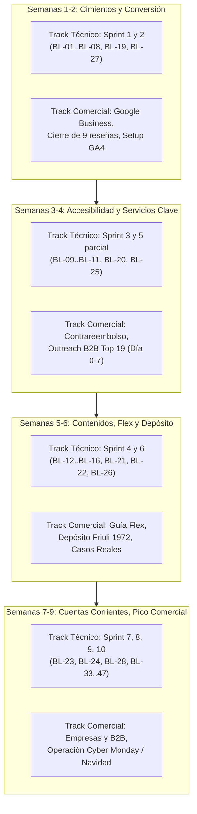
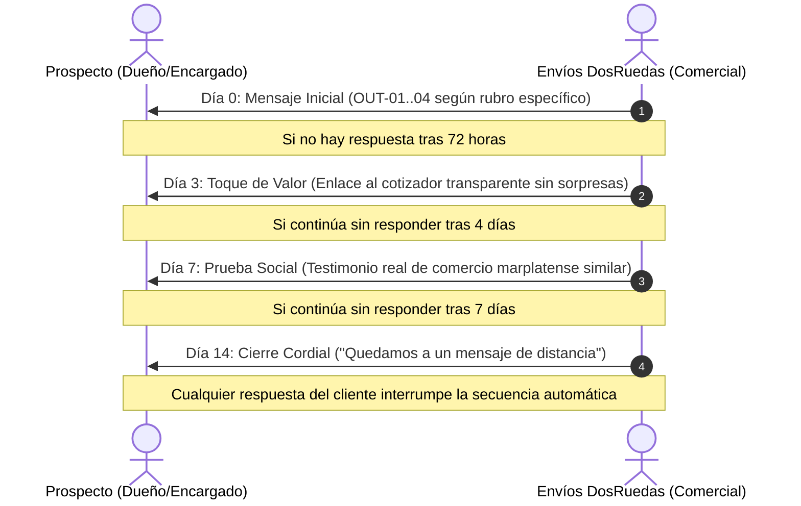

# INFORME Y HOJA DE RUTA INTEGRAL DE EJECUCIÓN (Q4 2026)

## Envíos DosRuedas · Mar del Plata, Argentina

**Basado en el corpus documental `docs/marketing/` (Fases F1 a F14, Backlog BL-01 a BL-47, Sistema Comercial y de Reputación)**  
_Fecha de emisión:_ 18 de septiembre de 2026  
_Estado operativo:_ En curso · Listo para ejecución sincronizada

---

## 1. Resumen Ejecutivo y Visión Estratégica

El presente informe constituye el **plan maestro unificado de acción** para Envíos DosRuedas, articulando en un solo cronograma coordinado los dos frentes vitales del negocio:

1. **El Track Técnico y de Producto:** Resolución de la deuda técnica, indexación, accesibilidad (WCAG), unificación de copys rioplatenses, diseño responsivo (Tailwind v4 / Next.js 16) y desarrollo de nuevas páginas de conversión (Sprints 1 al 10, ítems `BL-01` a `BL-47`).
2. **El Track Comercial, de Reputación y Crecimiento:** Activación de la presencia local en Google Business Profile, gestión de 9 reseñas huérfanas y aceleración a 50 reseñas verificadas, ejecución del plan de prospección B2B sobre 43 comercios marplatenses (19 prioritarios), y un ritmo de gestión semanal con 10 KPIs fijos.

### Objetivos Cuantificables a 90 Días

- **Conversión Web:** Reducir la tasa de rebote en móviles llevando el cotizador arriba del pliegue (≤ 600px), garantizando un único CTA primario por vista y medición precisa con GA4 (`quote_start`, `quote_complete`, `whatsapp_click`).
- **Reputación Local:** Pasar de 17 a 50 reseñas verificadas en Google Maps sin violar las políticas de Google (solicitudes orgánicas en rendiciones y confirmaciones de entrega).
- **Tracción B2B:** Contactar a los 19 prospectos prioritarios (indumentaria, estudios, laboratorios, repuestos), lograr 5 a 10 cuentas corrientes activas y captar sellers locales para la campaña de Mercado Envíos Flex de cara al pico de ventas (Cyber Monday / Fin de Año).

---

## 2. Fase 0: Matriz de Desbloqueo de Decisiones del Dueño

Para evitar que el desarrollo y las acciones comerciales queden paralizados a la espera de respuestas formales, se establece esta **Fase 0 de Desbloqueo Inmediato**. A continuación se listan las 11 decisiones pendientes identificadas en `F4-0-backlog.md` §4 y `F2-4-brand-review.md` §9, acompañadas por el **Valor por Defecto Propuesto** (recomendación operativa respaldada por el código y la experiencia de campo) con el que se comenzará a trabajar de inmediato:

| #      | Decisión Pendiente                                          | Ítems Bloqueados                 | Valor por Defecto Propuesto (Working Assumption)                                                                                                                                     | Justificación y Rationale Operativo                                                                                                                                                       |
| ------ | ----------------------------------------------------------- | -------------------------------- | ------------------------------------------------------------------------------------------------------------------------------------------------------------------------------------ | ----------------------------------------------------------------------------------------------------------------------------------------------------------------------------------------- |
| **1**  | **Antigüedad de la empresa** ("+7 años" vs "+15 años")      | BL-14, AboutHero, README         | **"+7 años de trayectoria en Mar del Plata"**                                                                                                                                        | Es la afirmación más sólida y conservadora identificada en `F2-4` y `OUT-04`. Evita riesgos legales por publicidad engañosa (Ley 24.240) mientras se verifica la fecha registral de 2011. |
| **2**  | **Volumen histórico de envíos** ("+50k envíos")             | BL-14, contadores SSR            | **"Miles de envíos entregados a tiempo"** (o quitar cifra fija y destacar "100% de compromiso local")                                                                                | Si no hay métrica auditable en el sistema de facturación, se reemplaza la cifra absoluta por una descripción cualitativa irrebatible.                                                     |
| **3**  | **Homologación / Certificación Flex**                       | BL-14, SchemaMarkup, FlexHero    | **"Servicio adaptado a los estándares de Mercado Envíos Flex"**                                                                                                                      | Eliminar "socio homologado/oficial" para evitar infracciones de marca de Mercado Libre; destacar que cumplimos con los horarios de corte 15:00 y entrega antes de las 20:00.              |
| **4**  | **Badge "Partner 3PL Verificado"**                          | BL-14, Footer                    | **"Centro de Depósito y Logística Local · Friuli 1972"**                                                                                                                             | Reemplazar el badge sin ente emisor por la dirección física real y el concepto de base de operaciones.                                                                                    |
| **5**  | **Horarios de atención unificados**                         | BL-02, JSON-LD, Contacto, Footer | **Lunes a Viernes 09:00 a 18:00 hs · Sábados 10:00 a 15:00 hs**                                                                                                                      | Horario comercial oficial confirmado por el dueño. Actualizado en `src/lib/constants.ts` y componentes.                                                                                   |
| **6**  | **Email de contacto público oficial**                       | BL-19, README, Contacto          | **`matiascejas@enviosdosruedas.com`** (en producción) / fallback **`matiascejas@enviosdosruedas.com`**                                                                               | Unificar en un solo buzón corporativo con dominio propio; no exponer correos de desarrollo (`dev@...`).                                                                                   |
| **7**  | **Tarifas Flex / Depósito / Emprendedores en `precios.md`** | BL-32, BL-20, BL-22              | **Flex:** Base $3.700 (zona 1) hasta $8.200 según km. **Depósito:** Almacenamiento bonificado con volumen mínimo de 20 envíos semanales. **Emprendedores:** Tarifa plana escalonada. | Se vuelca la tabla oficial de `AGENTS.md` (2026) a `docs/contexto/precios.md` como única fuente de verdad inmutable.                                                                      |
| **8**  | **Promesa Express y Umbral "A Consultar"**                  | BL-03, BL-07, cotizadores        | **Promesa Express:** "Entrega en franja de 60 a 90 min". **Umbral:** Hasta 20 km cálculo automático; > 20 km "A consultar vía WhatsApp".                                             | 20 km cubre la totalidad de General Pueyrredón urbana (incluyendo Batán y Camet periférico). Evita la discrepancia 15 vs 20 km.                                                           |
| **9**  | **Medios de pago en Contrareembolso y Facturación**         | BL-20, BL-29                     | **Efectivo y Transferencia / QR en el momento.** Facturación: **Factura C** (por defecto de monotributo/servicio), indicando posibilidad de coordinar factura A si aplica.           | Despeja la duda de los comercios sobre cómo reciben la recaudación de sus ventas.                                                                                                         |
| **10** | **Tipografía de cuerpo definitiva**                         | BL-37, globals.css               | **`IBM Plex Sans`** (secundaria `Outfit`)                                                                                                                                            | Mantiene la máxima legibilidad en formularios, tablas de tarifas y pantallas móviles exigida por `DESIGN.md`.                                                                             |
| **11** | **Componentes insignia huérfanos (`BL-43`)**                | BL-43, BL-44, BL-45              | **Opción A (Integrar):** Incorporar `DoubleBezelCard` y `CTANestedPill` en los cotizadores y páginas de servicio.                                                                    | Honra el contrato de diseño de `AGENTS.md` y `DESIGN.md` que exige doble bisel y pastilla anidada en CTAs clave.                                                                          |

---

## 3. Plan Maestro Integrado Semana a Semana (Semanas 1 a 9)

El plan maestro sincroniza en un horizonte de 9 semanas los requerimientos técnicos del Backlog (`F4-0`) con las acciones comerciales y de marketing de `F3-1`, `F7`, `F9` y `F14-1`.

---

### Detalle Semana por Semana

#### SEMANA 1 (22 al 28 de Septiembre)

- **Objetivo de la semana:** Frenar fugas de tráfico y conversión, asegurar la ficha de Google y sentar la telemetría analítica.
- **Track Técnico (Sprint 1):**
  - `BL-01`: Configurar redirecciones 301 para `/enviosflex` y rutas antiguas en `next.config.ts`; bloquear indexación de dominios duplicados de Vercel en `middleware.ts`.
  - `BL-02`: Unificar metadata global, eliminar `keywords` redundantes, insertar Schema JSON-LD con horarios reales y coordenadas de Friuli 1972 (`src/app/layout.tsx`).
  - `BL-03`: Centralizar constantes únicas de promesa y cotización en `src/lib/promises.ts` y sincronizar con `src/lib/pricing.ts`.
  - `BL-04`: Corregir contadores numéricos para renderizar su valor final en el HTML inicial (SSR) y reparar espacios de texto roto en `VisionSection.tsx` y `vertical-cut-reveal.tsx`.
  - `BL-19`: Unificar el correo público oficial en todo el código y documentación.
- **Track Comercial y Operativo:**
  - **Ficha Google Business Profile:** Completar categorías principales ("Servicio de mensajería", "Logística"), cargar horario unificado y subir las primeras 20 fotos reales de motos, riders y base Friuli 1972.
  - **Medición Base:** Exportar últimos 28 días de Search Console y verificar propiedad de GA4.
  - **WhatsApp:** Crear etiquetas de chats comerciales en WhatsApp Business y cargar respuestas rápidas según `F9-3`.
- **Entregable y Verificación:** Despliegue de Sprint 1 probado con `pnpm build` sin errores; ficha de Google 100% verificada y optimizada.

---

#### SEMANA 2 (29 de Septiembre al 5 de Octubre)

- **Objetivo de la semana:** Experiencia de cotización móvil impecable, rescate de reseñas y validación de las 11 decisiones.
- **Track Técnico (Sprint 2):**
  - `BL-05`: Implementar la regla de "Un solo CTA primario por vista" (botón amarillo oficial; header pasa a variante `outline` cuando el hero ya tiene CTA primario).
  - `BL-06`: Corregir accesibilidad del menú móvil (`MobileNav.tsx`): `role="dialog"`, trampa de foco, atributos `aria-expanded` y cierre con tecla Escape.
  - `BL-07`: Incorporar regiones dinámicas `aria-live` en los cotizadores Express y LowCost para lectura de cambios de tarifa en lectores de pantalla.
  - `BL-08`: Corregir ratios de contraste de texto atenuado (`brand-blue-400` → `brand-blue-600`) y bordes de foco en fondos oscuros (`globals.css`).
  - `BL-27`: Subir el formulario del cotizador Express al primer pliegue visual (primer input a ≤ 600px en vista móvil).
- **Track Comercial y Operativo:**
  - **Reseñas de Google:** Responder con tono personalizado y empático las **9 reseñas reales huérfanas** (según protocolo de `F7-reputacion.md` §6bis).
  - **Inicio del Programa de Reseñas:** Activar el envío del mensaje PZ-03 por WhatsApp inmediatamente después de cada rendición de dinero exitosa.
  - **Material Físico:** Diseñar e imprimir la tarjeta con código QR para el mostrador de Friuli 1972 (PZ-04).
- **Entregable y Verificación:** Flujo del cotizador navegable y accesible vía teclado/móvil; 100% de reseñas históricas respondidas.

---

#### SEMANA 3 (6 al 12 de Octubre)

- **Objetivo de la semana:** Lanzar el servicio de Contrareembolso y activar el motor de prospección comercial B2B.
- **Track Técnico (Sprint 3 + Sprint 5 parcial):**
  - `BL-09`: Añadir `aria-label` y alternativa textual descriptiva al mapa Leaflet (`LeafletRouteMap.tsx`).
  - `BL-10`: Implementar interruptor global de `prefers-reduced-motion` en `globals.css` y eliminar animaciones continuas distractoras (`animate-bounce`).
  - `BL-11`: Ampliar áreas táctiles de botones y controles móviles para cumplir con el estándar ≥ 44×44px.
  - `BL-20`: Crear la nueva página `/servicios/envios-contrareembolso/page.tsx` con esquema Service, tabla de funcionamiento y FAQ.
  - `BL-25`: Implementar eventos de conversión en GA4 (`quote_start`, `quote_complete`, `whatsapp_click`, `form_submit`).
- **Track Comercial y Operativo:**
  - **Prospección B2B (Primer Toque - Día 0):** Enviar el mensaje personalizado de primer contacto (`OUT-01` a `OUT-04`) a los 19 prospectos prioritarios de `F9-1-prospectos.xlsx`. Registrar cada contacto en `F9-4-crm.xlsx`.
  - **Comunidad Local:** Iniciar presencia activa en 3 grupos de Facebook de comerciantes y emprendedores de Mar del Plata (aportando valor logístico, sin spam comercial directo).
  - **Contenido:** Grabar y publicar el Reel 1: _"Así rendimos la plata del contrareembolso en el mismo día"_ (PZ-05).
- **Entregable y Verificación:** Página de contrareembolso en producción; 19 prospectos contactados y registrados en CRM.

---

#### SEMANA 4 (13 al 19 de Octubre)

- **Objetivo de la semana:** Seguimiento de prospectos, auditoría de marca en copys y citaciones locales.
- **Track Técnico (Sprint 4):**
  - `BL-12`: Limpiar jerga técnica ajena al cliente ("SLA", "3PL", "custodia digital", "batch") y reemplazar por lenguaje rioplatense directo.
  - `BL-13`: Normalizar todos los botones y llamadas a la acción según el glosario de verbos en modo imperativo voseo ("Cotizá", "Enviá", "Rastreá", "Contactanos").
  - `BL-14`: Reformular claims absolutos no respaldados ("0 paquetes extraviados" → "Compromiso de entrega garantizada", "+15 años" → "+7 años").
  - `BL-15`: Cambiar fondos de botones de WhatsApp externos (`#25D366`) al amarillo oficial de la marca (`brand-yellow-500`) según el contrato de diseño.
  - `BL-16`: Dinamizar el componente de prueba social para enlazar directamente a las reseñas verificadas en vivo en Google Maps.
- **Track Comercial y Operativo:**
  - **Seguimiento B2B (Toque 2 - Día 3 y Toque 3 - Día 7):** Enviar mensaje con enlace al cotizador y testimonios reales a prospectos que no respondieron el primer mensaje.
  - **SEO Local / Citaciones:** Dar de alta o corregir los datos de nombre, dirección y teléfono (NAP) idénticos en directorios locales (Páginas Amarillas, Cylex, Argentino.com.ar).
  - **Redes Sociales:** Publicar carrusel educativo en Instagram: _"Cómo funciona el contrareembolso en 4 pasos"_ (PZ-07).
- **Entregable y Verificación:** Sitios y copys limpios de jerga y afirmaciones riesgosas; matriz de seguimiento comercial actualizada en Excel.

---

#### SEMANA 5 (20 al 26 de Octubre)

- **Objetivo de la semana:** Captación de vendedores de Mercado Envíos Flex y alianza con agencias digitales.
- **Track Técnico (Sprint 5 final + Sprint 6 parcial):**
  - `BL-21`: Desarrollar y publicar la guía exhaustiva `/guias/envios-flex-mar-del-plata/page.tsx` (con esquema Article, mapa de zonas y tabla de horarios).
  - `BL-31`: Reestructurar la página de Flex existente para situar las tarifas y la política de recargo por lluvia en el primer tercio de lectura.
  - `BL-32`: Consolidar formalmente `docs/contexto/precios.md` y sincronizar los modelos de tarifas en la base de datos vía `prisma/seed.ts`.
- **Track Comercial y Operativo:**
  - **Campaña Flex Pre-Cyber Monday:** Publicar en comunidades de e-commerce la guía técnica para operar con Flex en Mar del Plata.
  - **Alianzas B2B:** Contactar a 3 agencias de marketing y desarrollo e-commerce de la ciudad para presentar el programa de derivación logística.
  - **Ficha de Google:** Lanzar la primera publicación semanal en Google Business Profile (novedad / servicio destacado).
- **Entregable y Verificación:** Guía Flex indexable y posicionando orgánicamente; reuniones coordinadas con agencias locales.

---

#### SEMANA 6 (27 de Octubre al 2 de Noviembre)

- **Objetivo de la semana:** Relanzamiento del Depósito y Fulfillment (Friuli 1972) y activación de referidos.
- **Track Técnico (Sprint 6):**
  - `BL-22`: Ejecutar el renombre de `/servicios/plan-emprendedores` a `/servicios/deposito-fulfillment` con redirección 301 estricta, fotos de la nave y mapa interactivo.
  - `BL-26`: Reordenar la página principal (Home) siguiendo la arquitectura canónica de `DESIGN.md` §6, incorporando el selector de segmentos.
  - `BL-30`: Optimizar la página de Contacto (`/contacto`): embeber mapa con chincheta en Friuli 1972, H1 geo-orientado y formulario simplificado.
- **Track Comercial y Operativo:**
  - **Campaña de Depósito:** Publicar Reel 2: _"Tu stock en Friuli 1972: del clic al despacho en moto"_ (PZ-13).
  - **Programa de Referidos:** Enviar mensaje directo a los comercios emblemáticos aliados ofreciendo bonificación en envíos por recomendar colegas.
  - **Recolección de Testimonios:** Solicitar autorización a 3 comercios reales para publicar sus casos de éxito con fotografía en la web.
- **Entregable y Verificación:** Página de Depósito en línea sin enlaces rotos; programa de referidos activo entre clientes actuales.

---

#### SEMANA 7 (3 al 9 de Noviembre)

- **Objetivo de la semana:** Preparación de contingencia operativa para Cyber Monday y despliegue de casos de clientes.
- **Track Técnico (Sprint 7 parcial + Sprint 8 parcial):**
  - `BL-33`: Maquetar e integrar el componente de Casos de Clientes Reales (foto, rubro, testimonio y métrica) en la Home y páginas de servicio.
  - `BL-34`: Implementar el logotipo vectorial oficial `/logo-master.svg` con un ancho renderizado mínimo de 120px.
  - `BL-35`: Reemplazar clases `h-screen` por `min-h-[100dvh]` en las 17 vistas detectadas para evitar problemas de visualización en Safari iOS.
- **Track Comercial y Operativo:**
  - **Sprint de Comunicación Cyber Monday:** Publicar serie de 5 historias diarias informando horarios de corte extendidos (15:00 hs) y refuerzo de flota para el evento de ventas.
  - **Seguimiento de Leads B2B:** Toque 4 (cierre cordial de secuencia) para prospectos pendientes de respuesta.
- **Entregable y Verificación:** Web preparada visualmente para soportar el pico de tráfico del evento nacional de comercio electrónico.

---

#### SEMANA 8 (10 al 16 de Noviembre)

- **Objetivo de la semana:** Operación intensiva Cyber Monday, captura masiva de reseñas y recopilación de métricas.
- **Track Técnico:** Congelamiento de código productivo durante las 72 hs pico (salvo hotfixes críticos). Desarrollo en staging de:
  - `BL-23`: Maquetación de la nueva página `/servicios/empresas-cuenta-corriente/page.tsx` con Server Action para captura directa de leads.
  - `BL-24`: Desarrollo de la página unificada `/cobertura/page.tsx` con mapa de delimitación barrial y tabla de kilómetros.
- **Track Comercial y Operativo:**
  - **Operación al Máximo:** Cobertura de entregas en tiempo y forma; soporte inmediato vía WhatsApp.
  - **Batería de Reseñas Masivas:** El miércoles del evento, disparar el pedido de reseñas (PZ-03) a todos los clientes y particulares con entregas completadas.
  - **Registro de Métricas:** Documentar porcentaje de cumplimiento, paquetes totales y tiempo medio de entrega para usar como respaldo comercial en futuras campañas.
- **Entregable y Verificación:** Cero demoras operativas registradas; salto cuantitativo en reseñas verificadas en Google Maps.

---

#### SEMANA 9 (17 al 23 de Noviembre)

- **Objetivo de la semana:** Cierre del ciclo de cuentas corporativas, auditoría de diseño e integración GEO.
- **Track Técnico (Sprint 7 final + Sprint 9 y 10):**
  - Despliegue en producción de `/servicios/empresas-cuenta-corriente` y `/cobertura`.
  - `BL-40` y `BL-41`: Optimización de visibilidad para motores de IA (actualización de `llms.txt` orientado a clientes y esquemas `BreadcrumbList`).
  - `BL-43` a `BL-47`: Normalización de los componentes insignia del Design System (`DoubleBezelCard`, `CTANestedPill`), accesibilidad motriz en `HeroProceduralBackground` y corrección de prompts de diseño.
- **Track Comercial y Operativo:**
  - **Prospección Corporativa Directa:** Presentación de la propuesta formal `PROP-01` (Cuenta Corriente) a distribuidoras y estudios seleccionados de la zona Champagnat y Colón.
  - **Evaluación de Pauta Publicitaria:** Analizar datos consolidados de GA4. Si la tasa de conversión en el cotizador supera el 8%, activar campaña exploratoria en Google Ads con presupuesto acotado.
- **Entregable y Verificación:** Ecosistema digital 100% libre de deuda técnica; primeras cuentas corporativas en proceso de apertura.

---

## 4. Desglose Exhaustivo de los Sprints Técnicos (BL-01 a BL-47)

Cada sprint agrupa tareas del backlog estructuradas bajo la regla de orden inquebrantable: **Bugs que afectan indexación/conversión → SEO técnico y accesibilidad crítica → Copy y marca → Nuevas páginas → Refactor estético y sistema de diseño**.

```mermaid
graph LR
    subgraph Core["Cimientos"]
        S1["Sprint 1<br/>Indexación y Conversión"]
        S2["Sprint 2<br/>A11y Crítica y Foco"]
        S3["Sprint 3<br/>Resto de A11y"]
    end
    subgraph Brand["Marca y Contenido"]
        S4["Sprint 4<br/>Copy y Afirmaciones"]
        S5["Sprint 5<br/>Precios y Flex"]
        S6["Sprint 6<br/>Depósito y Home"]
        S7["Sprint 7<br/>Páginas B2B"]
    end
    subgraph System["Deuda y Sistema"]
        S8["Sprint 8<br/>Estética y Docs"]
        S9["Sprint 9<br/>Visibilidad IA (GEO)"]
        S10["Sprint 10<br/>Design System"]
    end

    S1 --> S2 --> S3 --> S4 --> S5 --> S6 --> S7 --> S8 --> S9 --> S10
```

### Tabla Resumen de Sprints y Archivos Afectados

| Sprint        | Ítems BL                                 | Foco Primario                                   | Archivos Afectados                                                                                                                                          | Criterio de Aceptación (DoD)                                                                                                              |
| ------------- | ---------------------------------------- | ----------------------------------------------- | ----------------------------------------------------------------------------------------------------------------------------------------------------------- | ----------------------------------------------------------------------------------------------------------------------------------------- |
| **Sprint 1**  | BL-01, BL-02, BL-03, BL-04, BL-19        | Fugas técnicas, SEO y contadores SSR            | `next.config.ts`, `middleware.ts`, `src/app/layout.tsx`, `src/lib/promises.ts`, `src/lib/pricing.ts`, `VisionSection.tsx`, `README.md`                      | Redirección 301 funcional; schema JSON-LD validado; contadores visibles en HTML puro; 0 errores de build.                                 |
| **Sprint 2**  | BL-05, BL-06, BL-07, BL-08, BL-27        | Accesibilidad de cotizadores y móvil            | `HeroAnimado.tsx`, `MobileNav.tsx`, `CotizadorExpressForm.tsx`, `CotizadorLowCostForm.tsx`, `globals.css`                                                   | 1 CTA primario por vista; navegación por teclado en menú móvil; cotizador visible a ≤ 600px en smartphones.                               |
| **Sprint 3**  | BL-09, BL-10, BL-11, BL-17, BL-18        | Accesibilidad WCAG (mapa, movimiento, táctiles) | `LeafletRouteMap.tsx`, `globals.css`, `AddressAutocomplete.tsx`, `BatchGrid.tsx`, botones WhatsApp                                                          | Mapa con texto alternativo; respeto a `prefers-reduced-motion`; touch targets ≥ 44px; etiquetas aria completas.                           |
| **Sprint 4**  | BL-12, BL-13, BL-14, BL-15, BL-16        | Consistencia de copy rioplatense y marca        | `AboutHero.tsx`, `OptimizedFooter.tsx`, `SocialProofSection.tsx`, componentes de contacto                                                                   | Sin jerga ("SLA", "3PL"); modo imperativo voseo ("Cotizá", "Enviá"); WhatsApp en amarillo marca; enlaces a Google Maps.                   |
| **Sprint 5**  | BL-32, BL-20, BL-21, BL-25               | Precios, contrareembolso y telemetría           | `docs/contexto/precios.md`, `prisma/seed.ts`, `/servicios/envios-contrareembolso/page.tsx`, `/guias/envios-flex-mar-del-plata/page.tsx`, `ClientLayout.tsx` | Precios 2026 sincronizados; nuevas páginas indexables y responsivas; eventos GA4 disparando correctamente en consola.                     |
| **Sprint 6**  | BL-22, BL-26, BL-28, BL-30               | Depósito, Home canónica y Contacto              | `src/app/servicios/deposito-fulfillment/page.tsx`, `src/app/page.tsx`, `ContactForm.tsx`, `CotizadorExpressForm.tsx`                                        | Redirección 301 de plan-emprendedores; Home ordenada según DESIGN.md §6; ID único de cotización visible; mapa Friuli 1972 funcional.      |
| **Sprint 7**  | BL-23, BL-24, BL-29, BL-31, BL-33        | Empresas B2B, Cobertura y FAQ real              | `/servicios/empresas-cuenta-corriente/page.tsx`, `/cobertura/page.tsx`, `faqData.ts`, `FaqHero.tsx`, `TestimonialsSection.tsx`                              | Formulario de cuenta corriente guarda leads; mapa de zonas delimitado; buscador de FAQ sin respuestas ficticias; 3 casos reales visibles. |
| **Sprint 8**  | BL-34, BL-35, BL-36, BL-37, BL-38, BL-39 | Limpieza estética y alineación documental       | `OptimizedHeader.tsx`, `PROJECT.md`, `globals.css`, 17 vistas con `h-screen`, `SchemaMarkup.tsx`                                                            | Logo vectorial master ≥ 120px; sin scroll roto en Safari iOS (`100dvh`); archivo `PROJECT.md` creado resolviendo enlaces rotos.           |
| **Sprint 9**  | BL-40, BL-41, BL-42                      | Visibilidad y posicionamiento IA (GEO)          | `public/llms.txt`, `src/app/layout.tsx`, `next.config.ts`                                                                                                   | Archivo `llms.txt` actualizado con ofertas para humanos y modelos; esquemas `BreadcrumbList` activos; header `noindex` en previews.       |
| **Sprint 10** | BL-43, BL-44, BL-45, BL-46, BL-47        | Adopción de componentes de diseño               | `DoubleBezelCard.tsx`, `CTANestedPill.tsx`, `InputField.tsx`, `HeroProceduralBackground.tsx`                                                                | Reutilización de los 7 componentes insignia en cotizadores; reducción de código huérfano; paleta estricta de 3 colores sin fugas hex.     |

---

## 5. Motor Comercial B2B y Cuentas Corporativas (Fases 7, 9 y 10)

El motor comercial se nutre de los 43 prospectos reales identificados en `F9-1-prospectos.xlsx` y la estructura de atención inmediata documentada en `F9-3`.

### 5.1 Los 19 Prospectos Prioritarios (Top 20) y Secuencia de Outreach

Se distribuyen en cuatro segmentos estratégicos de Mar del Plata con alto volumen de envíos diarios:

1. **Comercio Online / Indumentaria y Calzado:** Tiendas en Güemes, San Juan y Peatonal San Martín con venta por Instagram y Tiendanube (necesitan contrareembolso con rendición en el día y Flex).
2. **Estudios Contables y Jurídicos:** Zonas Centro y Chauvín (necesitan traslados de balances, libros y trámites bancarios con cadetería de confianza).
3. **Laboratorios y Droguerías:** Distribución de análisis, insumos médicos y pedidos urgentes con puntualidad estricta.
4. **Casas de Repuestos y Ferreterías Industriales:** Avenidas Champagnat, Juan B. Justo y Colón (requieren envíos recurrentes bajo cuenta corriente y facturación unificada a fin de mes).

#### Secuencia de 4 Contactos (Multicanal WhatsApp / Email)

### 5.2 Protocolo de Respuesta Inmediata a Leads Entrantes (`F9-3`)

- **Tiempo Objetivo:** Menos de 15 minutos en horario comercial (Lunes a Viernes 08:30 a 18:30).
- **Regla de Oro:** Saludo personalizado, voseo marplatense natural, aclaración inmediata de que contamos con base física en Friuli 1972 y derivación al cotizador o visita personal.
- **Gestión:** Cada nuevo contacto se ingresa inmediatamente en la hoja "Oportunidades" de `F9-4-crm.xlsx` con fecha, canal de origen y estado inicial ("Contactado").

### 5.3 Propuestas Comerciales Tipo (`F10-1`)

Listas para completar con los datos de cada cliente:

- `PROP-01`: **Cuenta Corriente Mensual para PyMEs** (liquidación quincenal/mensual, factura unificada, tarifa preferencial por volumen).
- `PROP-02`: **Operación Integral Mercado Envíos Flex** (retiro diario en depósito del vendedor a las 14:00, entrega antes de las 20:00, reintento sin cargo).
- `PROP-03`: **Depósito y Logística Fulfillment** (almacenamiento en Friuli 1972, preparación de paquetes y despacho directo).

---

## 6. Estrategia de Reputación Local y SEO Local / IA

### 6.1 Plan de Aceleración de Reseñas de Google (De 17 a 50 en 90 días)

Google prohíbe explícitamente pagar u ofrecer incentivos por opiniones. El crecimiento se logrará mediante **oportunismo operativo**:

- **Disparador 1 (El más efectivo):** Inmediatamente después de rendir el efectivo de un contrareembolso:
  > _"Hola [Nombre], te transferimos la recaudación de los envíos de hoy ($[Monto]). Si te sirvió el servicio, ¿nos dejás una opinión breve en Google? Nos ayuda muchísimo a que otros comercios de Mar del Plata nos conozcan: [Enlace Corto GBP]. ¡Muchas gracias!"_
- **Disparador 2:** Al confirmar la entrega de un envío express o trámite urgente entre particulares o empresas.
- **Rescate de Reseñas Huérfanas:** El dueño responderá las 9 reseñas reales que aún no tienen contestación, mencionando el servicio y los barrios atendidos (ej. Güemes, Constitución, Mogotes) para reforzar el SEO semántico local.

### 6.2 Visibilidad en Motores de Inteligencia Artificial (GEO)

- **`public/llms.txt`:** Sintetiza la estructura del negocio, cobertura geográfica (Mar del Plata, Batán, Camet), servicios ofrecidos y política de precios para que motores como ChatGPT, Gemini y Perplexity citen a Envíos DosRuedas como referente logístico de la ciudad.
- **Datos Estructurados JSON-LD:** Configurar los esquemas `LocalBusiness`, `PostalAddress` y `OpeningHoursSpecification` con datos exactos y sin valores simulados de `AggregateRating`.

---

## 7. Ritmo de Gestión y Reporte Semanal ("Lunes de Marketing")

A partir de la definición de `F14-1-definicion-reporte.md`, se instaura una rutina semanal inmutable cada lunes a las 09:00 AM para evaluar el avance y ajustar prioridades.

### Los 10 Indicadores Clave de Seguimiento

| #      | Indicador                       | Fuente de Datos                          | Meta / Rango Normal                        | Umbral de Alerta Temprana                   |
| ------ | ------------------------------- | ---------------------------------------- | ------------------------------------------ | ------------------------------------------- |
| **1**  | **Visitas al sitio web**        | Google Analytics 4 (Sesiones)            | Crecimiento sostenido (+5% semanal)        | Caída > 25% respecto a media de 4 semanas   |
| **2**  | **Cotizaciones iniciadas**      | GA4 (evento `quote_start`, post BL-25)   | Ratio inicial: 20-30% de visitas           | Descenso abrupto en tasa de inicio          |
| **3**  | **Cotizaciones completadas**    | GA4 (evento `quote_complete`)            | Ratio completado: > 60% de iniciadas       | Abandono excesivo en cálculo de km          |
| **4**  | **Clics a WhatsApp**            | GA4 (evento `whatsapp_click`)            | Ratio conversión: > 10% de completadas     | Caída en intención de contratación          |
| **5**  | **Consultas entrantes reales**  | Conteo manual (WhatsApp + Formularios)   | 15 a 40 consultas nuevas / semana          | Menos del 50% de la media habitual          |
| **6**  | **Oportunidades nuevas en CRM** | `F9-4-crm.xlsx` (Hoja Oportunidades)     | 3 a 5 prospectos calificados / semana      | 2 semanas consecutivas con 0 ingresos       |
| **7**  | **Oportunidades ganadas**       | `F9-4-crm.xlsx` (Etapa "Ganado")         | 1 a 2 cuentas nuevas / semana              | Seguimiento de valor de ciclo de vida       |
| **8**  | **Reseñas nuevas y Rating**     | Ficha Google Business Profile            | 2 a 3 reseñas nuevas / semana (Media: 5.0) | Cualquier reseña ≤ 3 estrellas (alerta 24h) |
| **9**  | **Alcance en Redes Sociales**   | Meta Business Suite (Instagram/Facebook) | Crecimiento con publicaciones y reels      | Caída > 40% respecto a media habitual       |
| **10** | **Posición en 5 Keywords SEO**  | Google Search Console                    | Top 3 en "mensajería Mar del Plata"        | Caída de más de 5 posiciones en ranking     |

### Estructura Fija del Reporte Semanal (`F14-reporte-AAAA-SS.md`)

1. **Tabla Comparativa:** Los 10 indicadores (semana actual vs anterior y tendencia visual).
2. **Hechos Destacados (2-4 líneas):** Variaciones cuantitativas significativas sin interpretación subjetiva.
3. **Hipótesis Operativas:** Causas probables (factores climáticos, promociones, feriados locales, fallas técnicas).
4. **Radar Competitivo:** Monitoreo rápido de movimientos de tarifas o anuncios de competidores (MMDP, DAR Logística, Mar del Motos, Uber).
5. **Las 3 Acciones Prioritarias:** Compromisos concretos e inmediatos para los siguientes 7 días.

---

## 8. Conclusiones y Próximos Pasos Inmediatos

Con este informe, la incertidumbre documental queda completamente resuelta. El proyecto cuenta con un camino trazado donde cada archivo de código y cada contacto comercial tienen un propósito medible.

### Acciones para el Día 1:

1. **Validar la Fase 0:** Adoptar los valores por defecto recomendados para las 11 decisiones comerciales y habilitar el Sprint 1 sin bloqueos.
2. **Lanzar Sprint 1:** Ejecutar las tareas de indexación, redirecciones 301 y metadata (`BL-01` a `BL-04`, `BL-19`).
3. **Responder las 9 Reseñas:** Ingresar al panel de Google Business Profile y liquidar la deuda de respuestas de clientes históricos.
4. **Contactar los Primeros 5 Prospectos:** Abrir `F9-1-prospectos.xlsx` e iniciar la conversación con los comercios prioritarios del rubro indumentaria y calzado.
